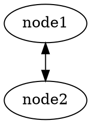
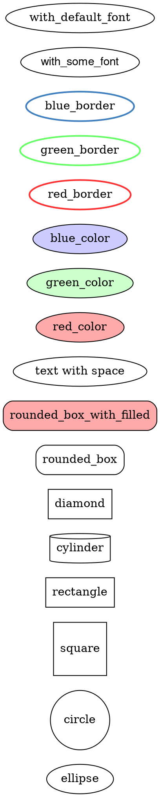
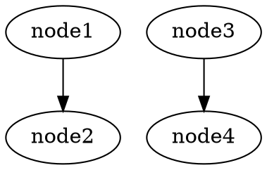
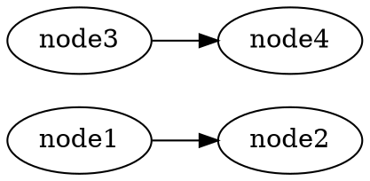

# graphviz

Graph from text

- `node` - node is node (text within box)
- `edge` - line between nodes

- example

## syntax

- normal edge: `node1 -> node2`;
- bidirectional edge: `node1 -> node2[dir=both];`
- color for node: `node1[color=blue];`
- color for edge: `node1 -> node2 [color=blue]`;
- circular box: `node1[shape=circle];`

## shapes

docs: https://graphviz.org/doc/info/shapes.html

## rankdir

